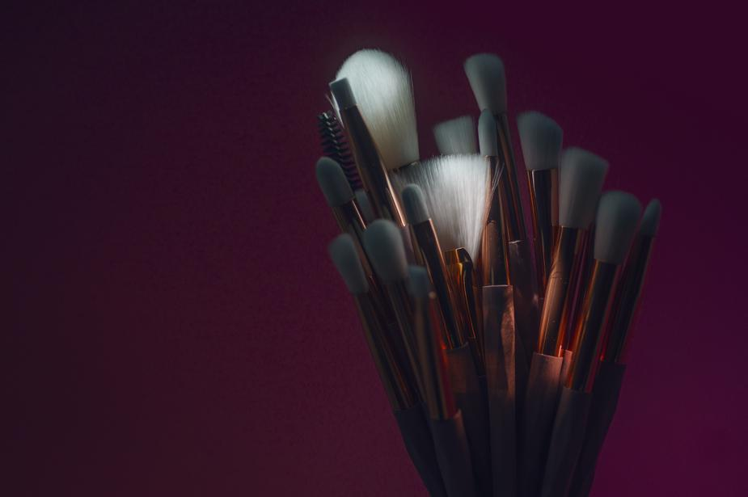

# dyPixa
A project to generate abstract images dynamically!


<!-- ALL-CONTRIBUTORS-BADGE:START - Do not remove or modify this section -->

<!-- ALL-CONTRIBUTORS-BADGE:END -->  
  


  
  
**dyPixa aka _Dynamic Pixels_**  
This project is started in order to develop a machine learning model integrated with a WebApp or CLI to generate awesome abstract arts based on the phrase entered by the user. Yesssss! You heard it right... an image inspired from the words!  
  
In order to design a descent Instagram Post for quotes, we often have to work a lot on the image creation. The idea of this project is to let the author input the sentiments and based on the keywords used to express it, an abstract image could be generated where colors may represent the intensity of the key-ords.  
  
There can be multiple ways to interpret the idea and hence several machine learning models can be developed to generate the images!!  

---

This project aims to collect the various data related to _Image &amp; Netural Language Processing_. The object is to finally develop an ML model that takes an english phrase and returns back an abstract image of squared resolution by utilizing the properties of the trained model. This whole functionality can be integrated with a WebApp, as well.  

<!--
## Scope of this repository
Our data analysis can be carried out in order to acheive the following outcomes:
a) How long (in terms of runs) a partnership between batsmen can go if provided boller is bolling currently
b) Hence, how much a team can score in an inning or 1st powerplay (provided data of first over)
c) We can make a ML model to predict the final ranking of the teams in points-table by the end of current season (based on the stats and data about the results of the previous few matches)..... and many more...

Let's know your ideas as well....
-->
  
## Wanna Contribute? ✨
  
It'd be great to join us and work toward some outstanding UI Development, Image Processing, Data Engineering & AI/ML ideas with **dyPixa**.  
Let's introduce a quick guide to being towards the contribution!!  

### Getting Started 🐢

 Just going through a certain steps, you can easily begin with your work!  
 Have a glimpse below:  

 1. **Grab the Data:**  
 Explore the various datasets available in the [```Datasets```](https://github.com/thedatatribune/dyPixa/dataset) directory.  
 You can contribute by adding your own dataset to this branch, as well!! It can be raw or processed or even the test phrases for expected inputs.    

 2. **Code Parallelly**  
 Find the dataset that interests you and begin with the codes to analyse the data.  
 You can share your code regardless of the language you use to code.  

 3. **Work Independently**  
 If you are confident enough in some other field say documentation/content-presentation or enhencement, you are most welcome.  
 You can also contribute with any other work, apart from those which are mentioned above. Just, make sure they are relavent to this project.

<!--

### Folder Conventions 📂

This project has **two** branches:  

> 1. **master** :  
>   _It's the default and the main branch of the project_
> 2. **dataset-definations** :  
>   _This branch basically holds the datasets and their proper documentations_  

  
_Folder structure conventions_ for the **master** branch of this project:  

```
    .
    .
    ├── Codes                   # All available codes
    │
    ├── Visualizations          # All visuals or graphs etc..
    │
    ├── src                     # Formal documentations of repo
    │   │
    │   ├── img                 # Stores documentation images 
    │   │
    │   .
    │   .
    │   └── ...         
    │
    ├── Codes.md                # Formal info about codes & their usage
    │
    ├── Datasets.md             # Brief intro about available datasets 
    │
    ├── Visualizations.md       # Documentations for visualizations
    │   
    ├── Stats                   # Stats holding directory
    │   │
    │   ├── Stats2020.md        # Previous stats on IPL-2020 
    │   │
    │   ├── Stats2021.md        # Previous stats on IPL-2021 
    │   .
    │   .
    │   └── ...     
    │
    │
    ├── contributors.md         # All contributors' list
    │
    ├── README.md                  
    │
    └── ...
```
  
_Folder structure conventions_ for the **dataset-defination** branch of this project:   
  
```
    .
    .
    ├── Datasets                # All available datasets
    │   │
    │   ├── deliveries.csv  
    │   │
    │   ├── matches.csv  
    │   │
    │   ├── players.csv  
    │   .
    │   .
    │   └── ...   
    │
    ├── Details                 # Datasets' detailed description
    │   │
    │   ├── deliveries.md  
    │   │
    │   ├── matches.md  
    │   │
    │   ├── players.md  
    │   .
    │   .
    │   └── ...   
    │
    ├── README.md  
    │
    └── ...
```  
  
### Contribution Guide 📚  

We have got a range of contributors, since we've started with this peoject. In fact you can explore our [contributors' list](./contributors.md) to know about them!  
If you too wish to be in our contributors' list, it'd be our pleasure 😃   
It involves a sequence of easy and simple steps to be there! So, head towards our [contribution guide](./src/contributionGuide.md) right now to give your contribution!!  

-->

---  

## License ⚖️

This project is licensed under the MIT License - see the [LICENSE.md](./LICENSE.md) file for details.
